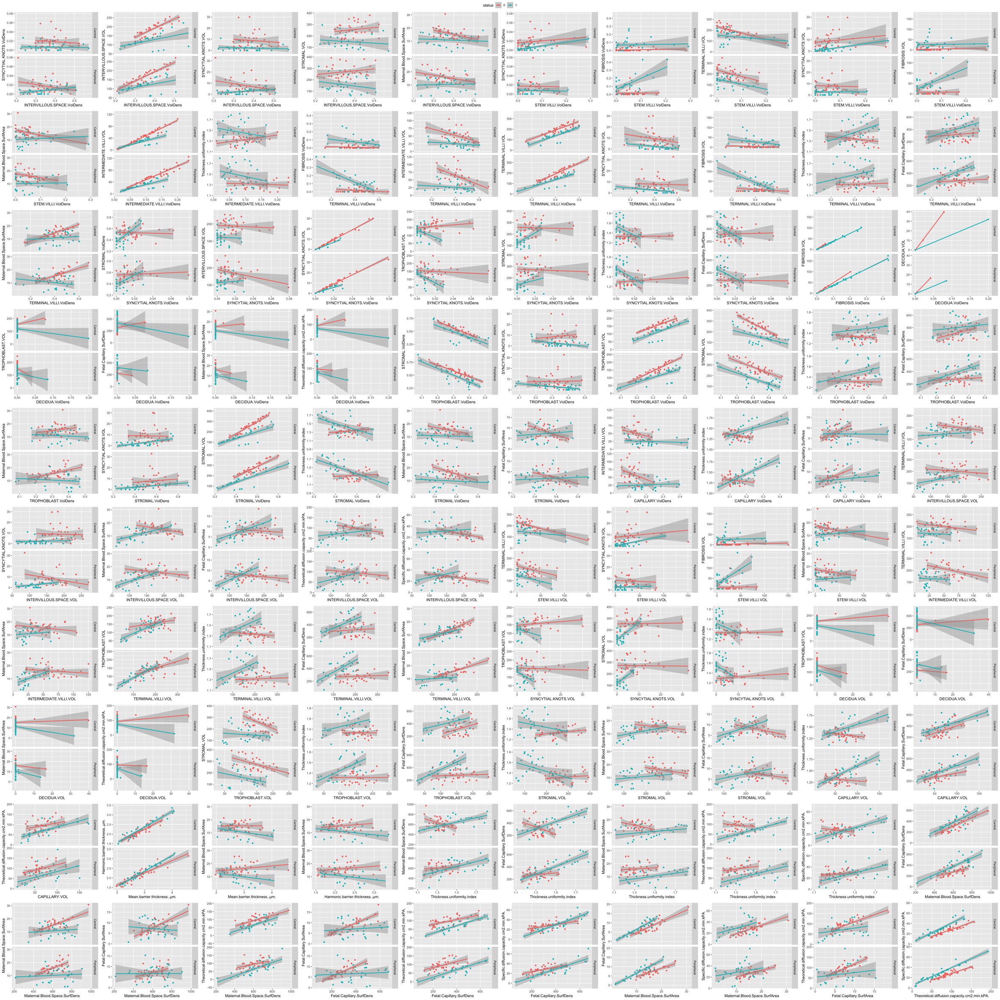

# Best correlations 

```
aov = anova(lm(p2~p1,data),lm(p2~p1*status,data))
got p-value
fdr calculated 
significance in Central and Peripheral indicated 
```
## Common regressions


## Each line - one patient


# Results

LOOCV procedure:
- excluding all measurements of one patient on each step
- train the glmnet model on all measurements of the remaining patients (allowing model to select hyperparameters with cross-validation for 5 folds)
- getting prediction for *excluded patient* as probablity and as binary factor (by detecting best treshold on train set)

## Without dividing into central and peripheral parts:
considering to types of models:
- on all signs
- only on Volume and VolDens signs
[all together measurements](./images/predictions_together.htm) 

## Separately central and peripheral parts
considering to types of models:
- on all signs
- only on Volume and VolDens signs
[separated measurements (central and peripheral)](./images/predictions_sep.htm)

                          


