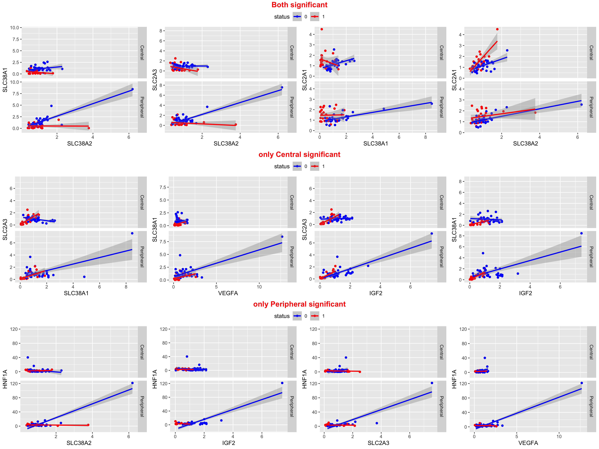
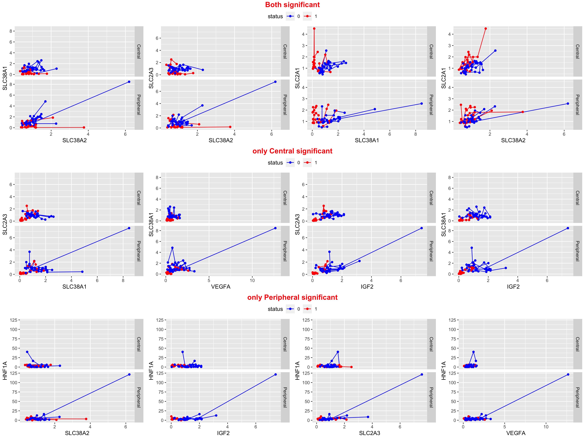
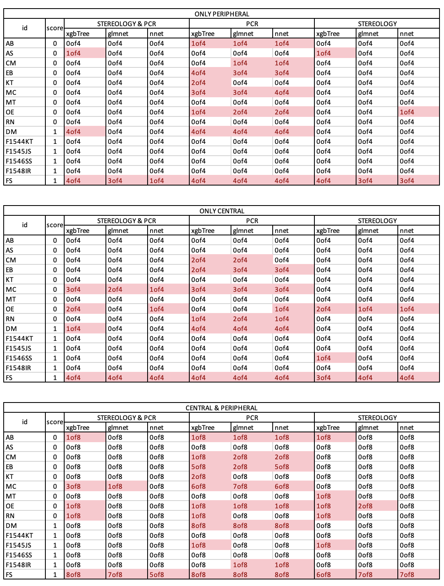

[old page](old_page.md)

# CORRELATION PLOTS
## Best correlations 
```
aov = anova(lm(p2~p1,data),lm(p2~p1*status,data))
p-value
fdr 
significance in Central and Peripheral
```
### STEREOLOGY
Common regressions for STEREOLOGY ([see Figures on old page](old_page.md))\n

Each line - one patient for STEREOLOGY  ([see Figures on old page](old_page.md))

### PCR
Common regressions for PCR

Each line - one patient for PCR


# MODELS

## EXCLUDED
Samples MS (without PCR data) and KH (without STEREOLOGY data) were excluded for uniformity
## NOTE
- considering ML models: *glmnet, xgbtree, nnet*
- considering ML models on measurements: ONLY PERIPHERAL, ONLY CENTRAL, PERIPHERAL & CENTRAL
- considering ML models on signs: ONLY STEREOLOGY, ONLY PCR, STEREOLOGY	& PCR

## Results

LOOCV procedure:
- excluding all measurements of one patient on each step
- train the *glmnet, xgbtree, nnet* models on all measurements of the remaining patients (allowing model to select hyperparameters with cross-validation for 5 folds)
- getting prediction for *excluded patient* as probablity and as binary factor (by detecting best treshold on train set)




                          


